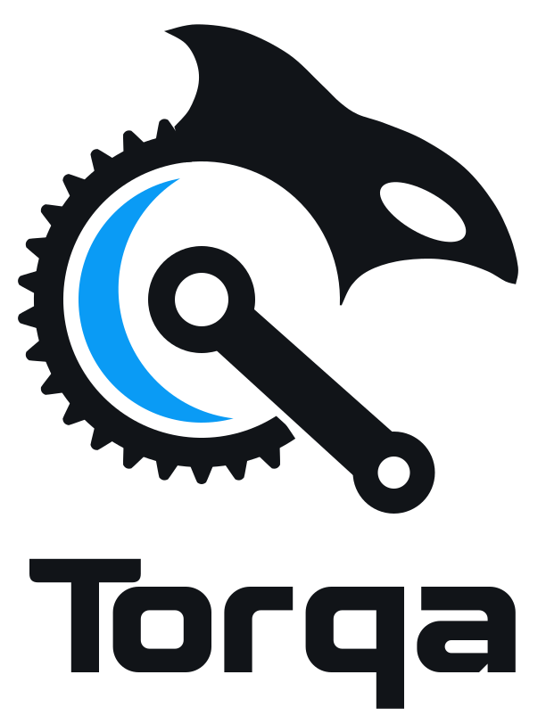
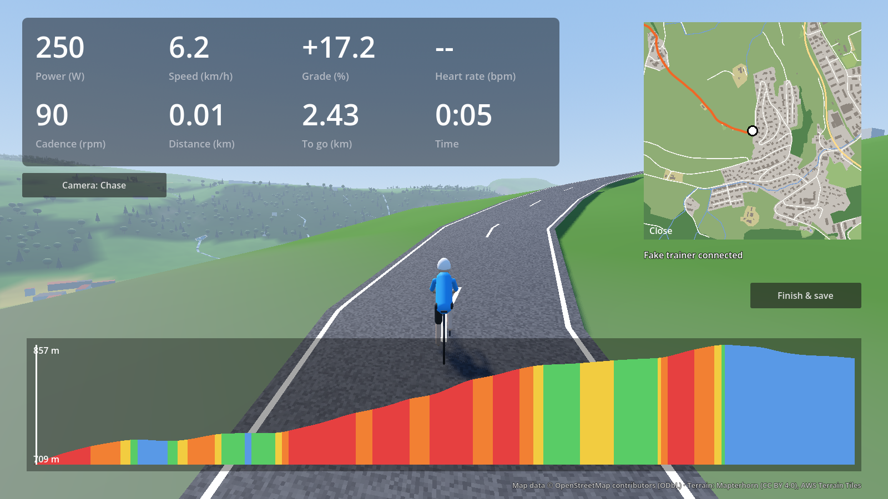

  <picture>
    <source media="(prefers-color-scheme: dark)" srcset="docs/brand/torqa-lockup-dark.svg">
    
  </picture>

# Torqa

A modern, offline-first, open-source indoor cycling app. Import a GPX route and ride it on your
smart trainer through a generated 3D world, a synced ride video, or street-level imagery.

> **Status:** early development — see [docs/PLAN.md](docs/PLAN.md).

## Features (planned)

- Smart trainer control over Bluetooth FTMS (Wahoo KICKR Core 2 and other trainers): SIM, ERG, resistance
- GPX import with terrain-corrected elevation
- Semi-realistic 3D worlds generated from real terrain and OpenStreetMap data — rideable offline
- Video rides with GPS sync and variable playback speed
- Google Street View / Mapillary rides
- Realistic physics, adjustable trainer difficulty, ghosts and pacers
- FIT export, ride history and analysis

See [docs/REQUIREMENTS.md](docs/REQUIREMENTS.md) for the full list.

## Development

All tooling runs in a container — nothing is installed on your machine.

1. Install [Docker](https://www.docker.com/) and [VS Code](https://code.visualstudio.com/) with the
   [Dev Containers](https://marketplace.visualstudio.com/items?itemName=ms-vscode-remote.remote-containers) extension.
2. Open this folder in VS Code and choose **Reopen in Container**.

Without VS Code, `scripts/dev.sh <command>` runs any command in the same container.

| Task | Command (inside the container) |
|---|---|
| All checks (fmt, clippy, tests, cargo-deny, gdlint, GDExtension smoke test) | `scripts/check.sh` |
| Build the GDExtension into `app/bin/` | `scripts/build-gdext.sh [debug\|release]` |
| Render ride screenshots (software Vulkan) into `screenshots/` | `scripts/screenshots.sh` |
| Run the CLI with the fake trainer | `cargo run --manifest-path core/Cargo.toml -p torqa-cli -- ride --fake` |

To test real trainers on macOS, use the CLI built by CI: see [docs/cli.md](docs/cli.md).
To keep prepared routes for offline riding and sharing, see [docs/courses.md](docs/courses.md);
rider profiles and zones are described in [docs/riders.md](docs/riders.md).

Docker on macOS cannot access Bluetooth or the GPU, so macOS builds are produced by GitHub Actions.
To test 3D rendering or a real trainer, run the built app (or the portable Godot editor) natively.

Contributor conventions: [CLAUDE.md](CLAUDE.md). Architecture decisions: [docs/adr/](docs/adr/).

## License

[GPL-3.0](LICENSE)
