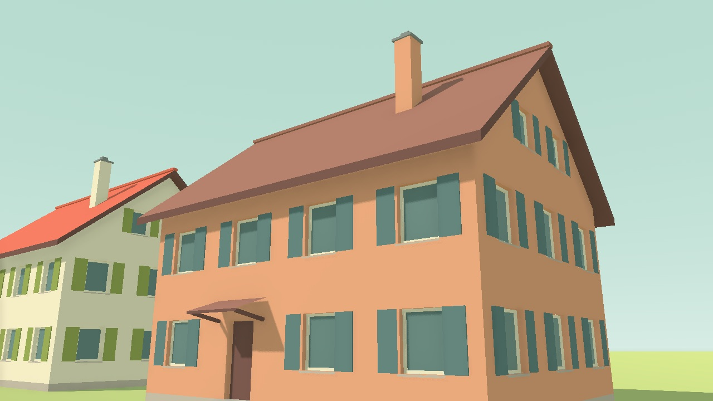
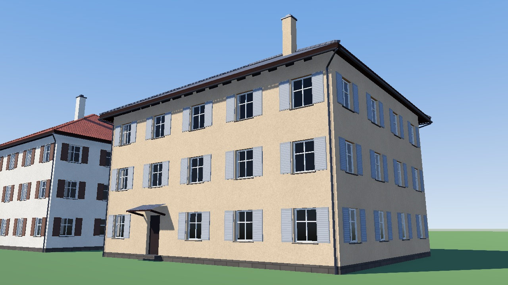
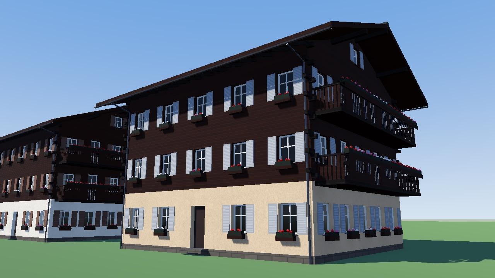
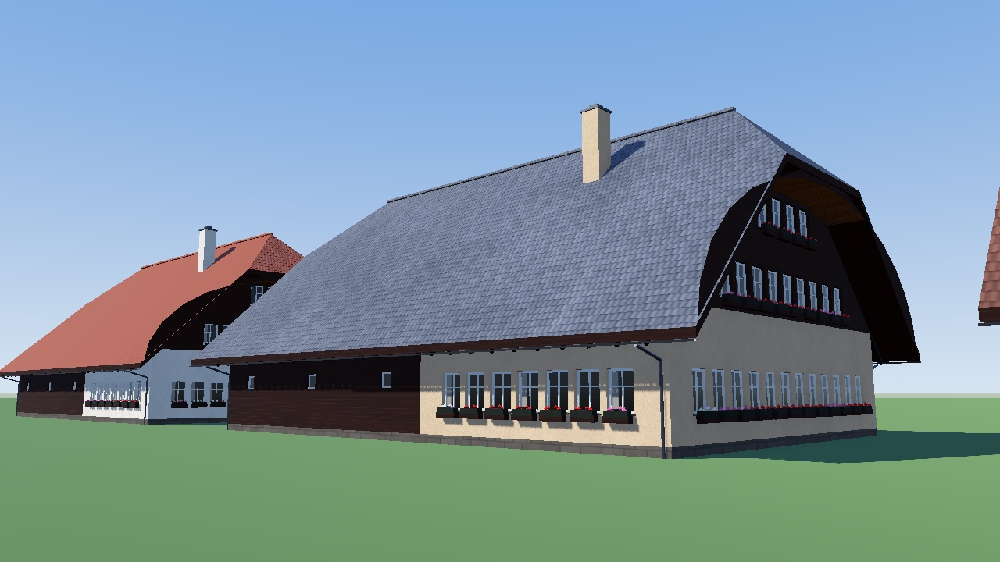
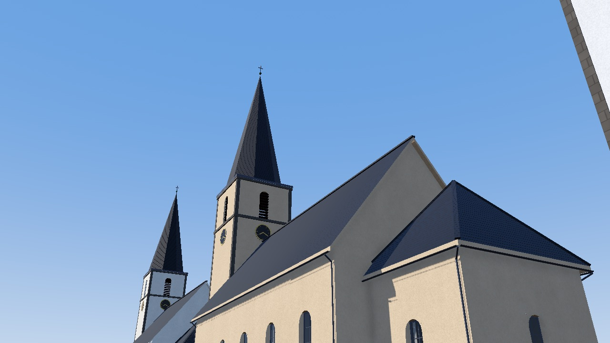
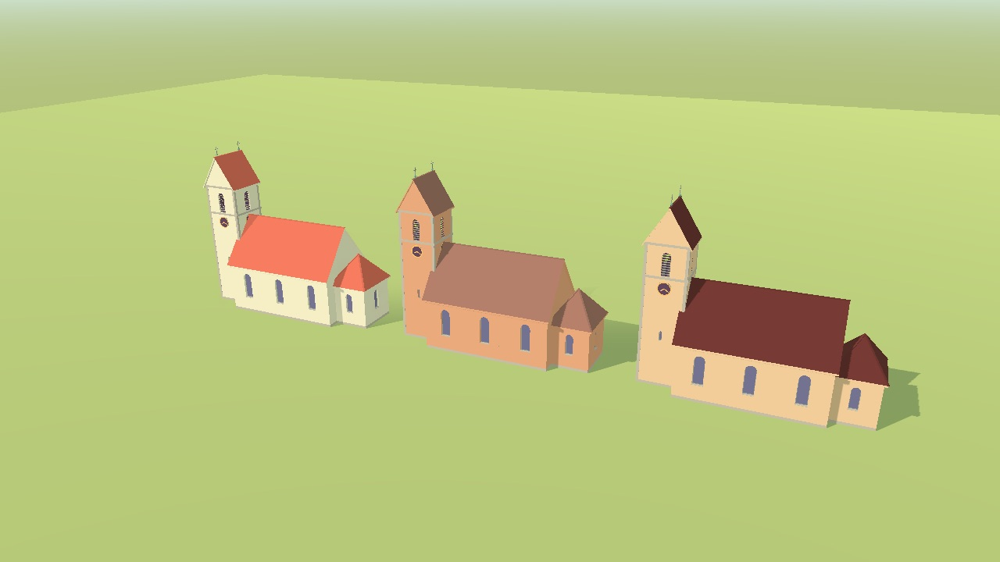
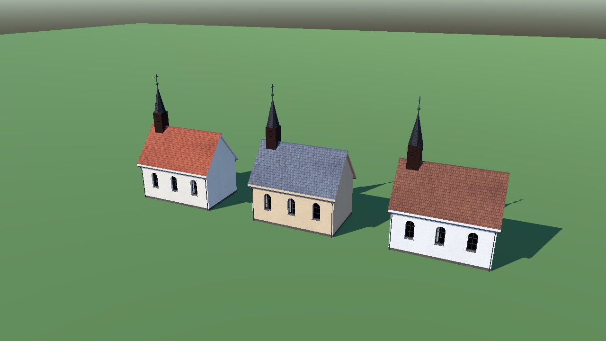

# Art

Scripted 3D models for Torqa ([ADR 0009](../docs/adr/0009-asset-pipeline.md)). The scripts are
the source; the exported `.glb` files are committed so the app builds without Blender.

## Running Blender

Blender runs headless in its own container (official Linux builds exist for x86-64 only, so on
Apple Silicon Docker emulates it):

```sh
scripts/art.sh blender --background --factory-startup --python art/buildings/build.py
scripts/art.sh blender --background --factory-startup --python art/buildings/build.py -- chalet_2_m
```

The second form rebuilds only the named models. Then review them as the world draws them
(runs in the dev container; images land in `screenshots/models/`):

```sh
scripts/dev.sh scripts/render-models.sh
scripts/dev.sh sh -c 'MODELS="chalet_2_m" scripts/render-models.sh'
```

## Buildings (`buildings/`)

- `catalogue.json` lists the models: kind, size, storeys, roof pitch and cover.
- `kinds.py` builds each kind: `house`, `chalet`, `farmhouse` (Bernese, with the Ründi arch),
  `church` (nave, choir, tower with clocks and a needle spire or saddle roof), `chapel`
  (with a roof turret) and `shed` (also garages).
- `kit.py` holds the pieces: walls with recessed openings, windows with frames, glazing bars,
  sills and shutters, doors, balconies, flower boxes, gable, hipped and half-hipped roofs with
  rafters, gutters and downpipes, spires and clocks.

Models use metres with x along the building, y across it and z up; the origin is the centre of
the footprint at ground level, and walls reach 3 m below it for slopes. Texture coordinates
are metres on each surface (walls: along and up; roofs: along the eaves and up the slope).

The files carry no textures: each face has a material **name**, and the app gives every name
its look in `app/scenes/building_models.gd` and `app/shaders/building_model.gdshader`. New
names need an entry there. Fine detail is drawn rather than modelled where that saves many
triangles: glass gets its texture coordinates spanning its panes (2 × 2 panes: 0–2 × 0–2) and
draws glazing bars where they cross whole numbers; shutters draw their slats. Keep the models
lean: towns place thousands of them.

| Name | Used for |
|---|---|
| `plaster` | rendered walls; the colour varies per building |
| `stone` | plinths, sills, quoins |
| `wood`, `wood_dark`, `wood_light` | boarded walls, balconies; beams and rafters; the Ründi |
| `frame`, `glass`, `leaded` | window frames; glass with white or (in churches) lead glazing bars |
| `shutter`, `door`, `garage` | shutters (colour varies per building), doors |
| `tiles`, `slate`, `sheet` | roofs: tiles in the building's roof colour, slate, sheet metal |
| `metal`, `copper` | gutters, caps, finials; spires |
| `flowers`, `leaves` | geraniums in boxes and on balconies |
| `clock` | clock dials |

The build also writes `models.json` next to the models: each model's kind, roof, the footprint
its walls stand on (`length` along x, `width` along y), `eaves` and total `height`. The world
reads it to fit models to the outlines on the map.

### Gallery

Rendered with `scripts/render-models.sh` (three variants per model; colours vary per building):

| | |
|---|---|
|  |  |
|  |  |
|  |  |
|  | |

## Vegetation (`vegetation/`)

`build.py` holds the catalogue and the kinds in one file: `conifer` (a trunk under stacked
cones, each turned a little), `broadleaf` (a trunk under one or more chunky 20-facet blobs),
`bush` and `rock`. Shapes are faceted (one normal per face) and lean — 20 to 70 triangles —
since forests place thousands; random shapes use fixed seeds, so rebuilds give the same files.

```sh
scripts/art.sh blender --background --factory-startup --python art/vegetation/build.py
```

| Name | Used for |
|---|---|
| `leaves` | crowns and bushes; the colour varies per plant (palette `plants.conifers`, `plants.broadleaves`, `plants.bushes`) |
| `trunk` | trunks (palette `plants.trunk`) |
| `rock` | rocks; the colour varies per rock (palette `plants.rocks`) |

The app gives each name its look in `app/scenes/vegetation_models.gd` and
`app/shaders/vegetation.gdshader` (trees sway a little in the wind). `models.json` lists each
model's `kind` and `height`; the world (`core/torqa-world/src/vegetation.rs`) picks one model
of the kind it wants per plant.
