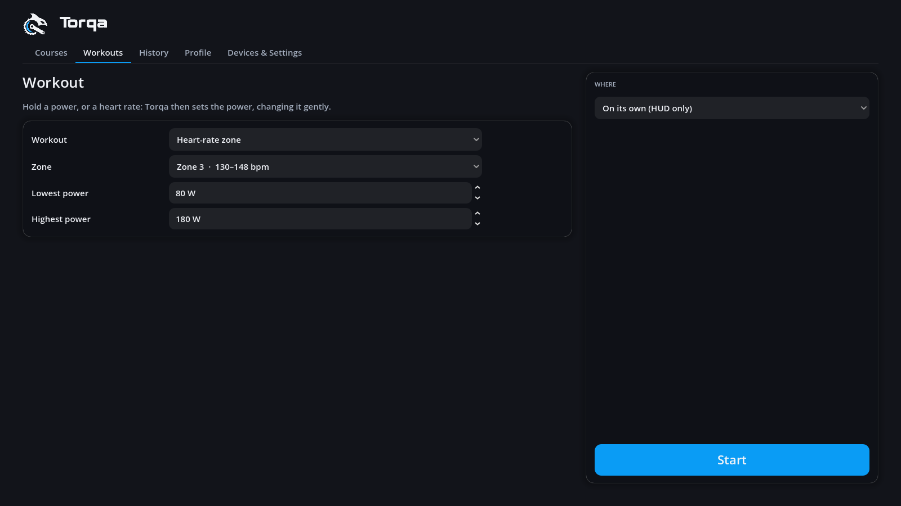
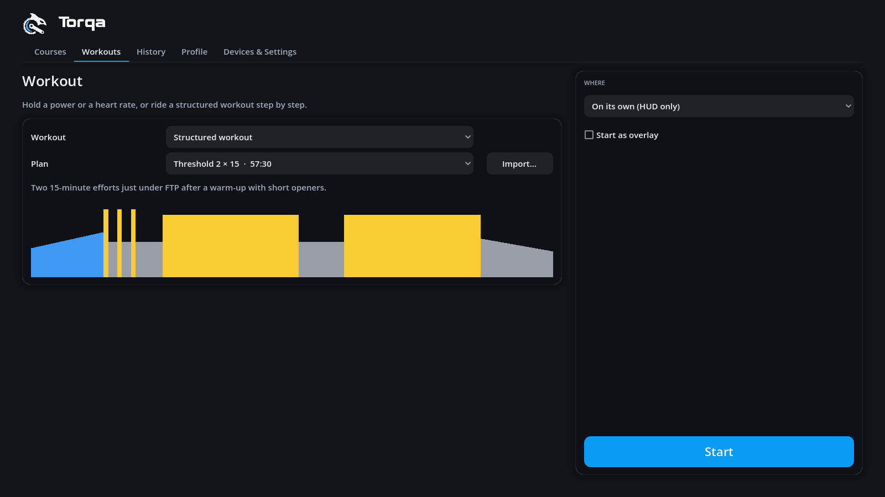
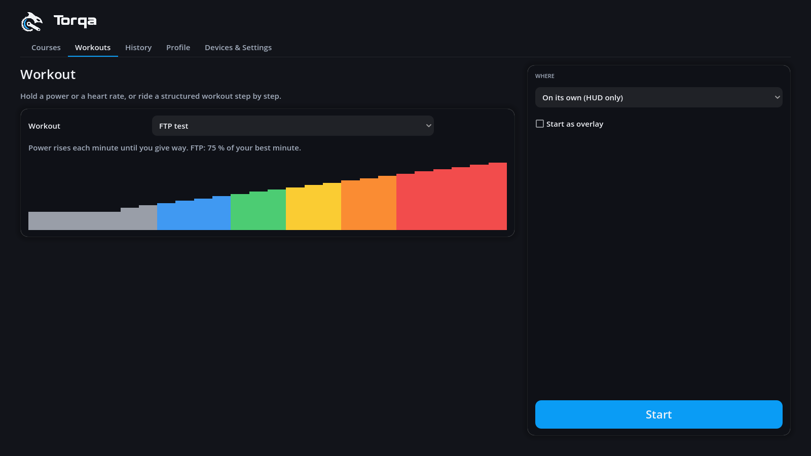
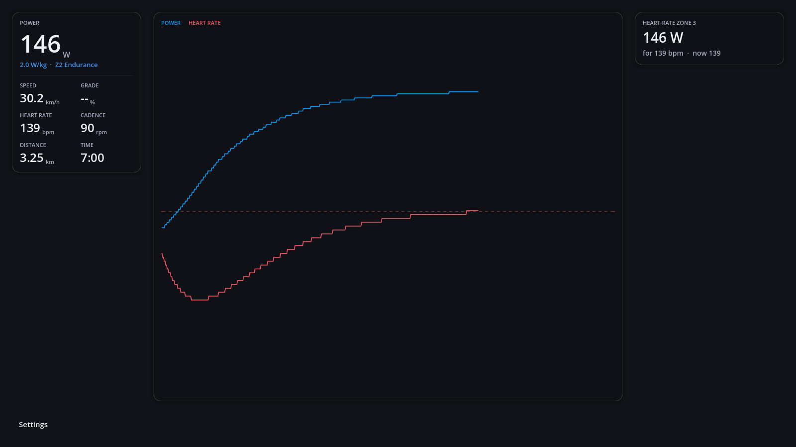

# Workouts

The **Workouts** tab on the start page sets up a workout (R56): instead of following the road,
the trainer holds a power (ERG mode).

- **Constant power** — the trainer holds the power you set, e.g. 200 W.
- **Heart-rate zone** — Torqa holds your heart rate in the middle of a zone (zone 3 of a 185 bpm
  maximum: 139 bpm) by setting the power for you.
- **Heart rate** — the same for a heart rate you choose, in bpm.
- **Structured workout** — steps of set power one after the other (R21): a built-in one, or a
  workout file you import (see below).
- **FTP test** — finds your FTP (R22), see below.

The zones are your rider's (from their maximum heart rate, [riders.md](riders.md)); new values
start from your FTP. A heart-rate workout needs a heart rate: a strap, or the fake trainer's
simulated one ([riding.md](riding.md)).

## Structured workouts

Choose **Structured workout** and a plan: its description and its steps show below, coloured by
power zone for your FTP (free steps grey). Five come built in — Recovery 30, Endurance 60,
Sweet spot 3 × 10, Threshold 2 × 15 and VO2max 5 × 3 — and **Import…** adds workout files:

| File | From | What Torqa reads |
|---|---|---|
| `.zwo` | Zwift, whatsonzwift.com, many coaches | Warm-ups, cool-downs, ramps, steady steps, intervals, free rides and max efforts; cadence targets; text messages |
| `.erg`, `.mrc` | TrainerRoad, Golden Cheetah, older tools | Points in watts (ERG) or % of FTP (MRC) joined by ramps; text messages |
| `.fit` | Garmin Connect, TrainingPeaks, intervals.icu | Steps by time with a power range (its middle is held), power zone or none; repeats; step names as messages |

Imported files are copied into `workouts/` in your data folder, shared by all riders like the
courses. Power given as a share of FTP follows the rider's FTP; ERG files in watts stay in
watts. Not supported (the file is refused with a message): steps by distance or until the lap
button, running workouts.

During the workout the panel shows the step (with its time left and cadence), what comes next,
and the workout's messages. Free steps ("free ride", "max effort") let the trainer simulate the
road instead of holding a power. On its own, the ride ends after the last step and is saved
under the workout's name; on a course you ride on freely after it until the finish.

## FTP test

A ramp test: after 5 minutes of warm-up at 40 % of your FTP, the power starts at half of it and
rises by 6 % of it every minute — until you cannot hold it. Pedal at your usual cadence; when
it stays below 50 rpm for 10 seconds, the test is over and saved (you can also finish it
yourself from the settings). Most riders give way after 15–25 minutes in all, and it needs no
pacing: just hold on as long as you can.

Your FTP is then **75 % of your best minute**. The summary shows it next to your current FTP,
with a button to use it: your power zones, heart-rate holds and structured workouts follow at
once. The estimate stays with the ride in the history.

The test starts from the FTP in your profile; if that is far off, the steps are too small or
too big, but the result is still good — test again with the new value for the best steps.

## Holding a heart rate

Heart rate follows power only after 30–60 s, so Torqa changes the power gently:

- It starts at the **lowest power** you set and rises by at most 30 W a minute.
- It never goes below the lowest or above the **highest power**. If your target needs more than
  the highest power, the trainer stays there.
- Without a heart rate (strap off, or dropped out) the power stays where it is until the heart
  rate is back.
- As your heart rate drifts up over a long ride, it eases off.

Expect to reach the target after about 5–10 minutes. The lowest power is also your warm-up:
set it to something you can ride easily.

## Where

- **On its own** — no route: the screen shows your HUD, the workout's targets and a live chart
  of power and heart rate. Speed and distance are those of a flat road at your power.
- **On a course** — any course of your library with a place (not Tacx RLV videos), ridden in
  its 3D world. The trainer holds the workout's power while the course's gradient sets your
  speed; the world looks as last set on the course page. The ride ends at the finish.

**Start** connects the trainer chosen under Devices & Settings, builds the course's world if
needed, and starts. With **Start as overlay** ticked, Torqa then shrinks to just the HUD on top
of your other windows, e.g. over a video ([overlay.md](overlay.md)).

## During the workout

The panel at the top right shows what the workout asks for: the power the trainer holds and, for
a heart-rate workout, the heart rate it aims at and your heart rate now. The settings dialog
(**S**) has a **Workout** tab to change it as you ride, e.g. another zone or more power; the
change reaches the trainer at once. **Finish & save** puts the workout into the history: on its
own under its name (e.g. "Heart-rate zone 3"), on a course under the course's name. Workouts on
their own are saved as indoor cycling FIT files without GPS positions.

The command line rides the same workouts: see [cli.md](cli.md#ride-a-workout).
